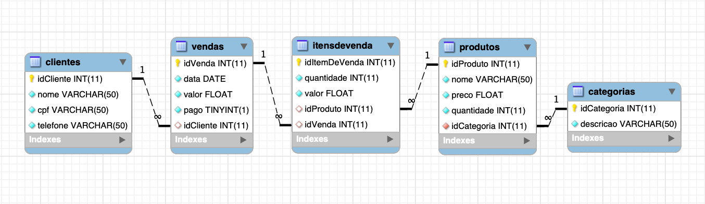

# SalesSystemMVC - POO Project

The intent of this project is share the progress that I'm doing with POO using Java.

## 🚀 Functional Requirements

- Register, alter and remove clients;
- Register, alter and remove products;
- Register, alter and remove categories;
- Register, alter and remove sales;
- Generate month sales chart;
- Generate overview about the quantity of products in stock;

## 🚀 Database Modeling

## 🚀 Demonstration

You can visit the demonstration [here](https://www.youtube.com/watch?v=aP-1xXkPsm0&t=56s).

## 🛠️ Built with

* [Java](https://docs.oracle.com/javase/8/docs/)
* [JavaFX](https://openjfx.io/)
* [Netbeans](https://netbeans.apache.org/)
* [JasperSoft](https://community.jaspersoft.com/)
* [SceneBuilder](https://gluonhq.com/products/scene-builder/)
* [MySQL Workbench](https://www.mysql.com/products/workbench/)

---
⌨️ com ❤️ por [Raquel Darelli Michelon](https://github.com/RaquelMichelon) 😊
